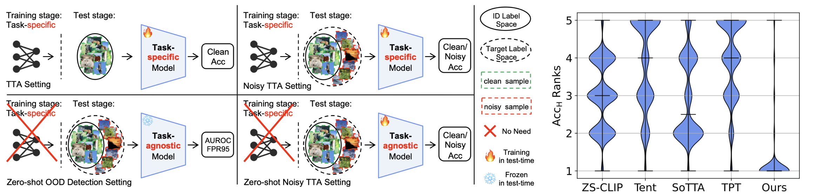

<h1 align="center"> Noisy Test-Time Adaptation in Vision-Language Models </h1>

<p align="center"> 
    <a href="https://openreview.net/forum?id=iylpeTI0Ql">  </a>
    
</p>
</div>
<div class="is-size-5 publication-authors" align="center">
            <span class="author-block">
              <a href="https://scholar.google.com/citations?user=vZPl_oQAAAAJ&hl=en">Chentao Cao</a>,
            </span>
            <span class="author-block">
              <a href="https://zhunzhong.site/">Zhun Zhong</a>,
            </span>
            <span class="author-block">
              <a href="https://andrewzhou924.github.io/">Zhanke Zhou</a>,
            </span>
            <span class="author-block">
              <a href="https://tongliang-liu.github.io/">Tongliang Liu</a>,
            </span>
            <span class="author-block">
              <a href="https://yliuu.com/">Yang Liu</a>,
            </span>
            <span class="author-block">
              <a href="https://www.andrew.cmu.edu/user/kunz1/index.html">Kun Zhang</a>,
            </span>
            <span class="author-block">
              <a href="https://bhanml.github.io/">Bo Han</a>
            </span>
</div>


<div align="center">
    
    <br>
    <em> Comparison between TTA, noisy TTA, zero-shot OOD detection, and the proposed zero-shot noisy TTA (left).  Performance ranking distribution of five TTA methods across 44 ID-OOD dataset pairs (right).</em>
</div>

### Abstract
Test-time adaptation (TTA) aims to address distribution shifts between source and target data by relying solely on target data during testing. In open-world scenarios, models often encounter noisy samples, i.e., samples outside the in-distribution (ID) label space. Leveraging the zero-shot capability of pre-trained vision-language models (VLMs), this paper introduces Zero-Shot Noisy TTA (ZS-NTTA), focusing on adapting the model to target data with noisy samples during test-time in a zero-shot manner. In the preliminary study, we reveal that existing TTA methods suffer from a severe performance decline under ZS-NTTA, often lagging behind even the frozen model. We conduct comprehensive experiments to analyze this phenomenon, revealing that the negative impact of unfiltered noisy data outweighs the benefits of clean data during model updating. In addition, as these methods adopt the adapting classifier to implement ID classification and noise detection sub-tasks, the ability of the model in both sub-tasks is largely hampered. Based on this analysis, we propose a novel framework that decouples the classifier and detector, focusing on developing an individual detector while keeping the classifier (including the backbone) frozen. Technically, we introduce the Adaptive Noise Detector (AdaND), which utilizes the frozen model’s outputs as pseudo-labels to train a noise detector for detecting noisy samples effectively. To address clean data streams, we further inject Gaussian noise during adaptation, preventing the detector from misclassifying clean samples as noisy. Beyond the ZS-NTTA, AdaND can also improve the zero-shot out-of-distribution (ZS-OOD) detection ability of VLMs. Extensive experiments show that our method outperforms in both ZS-NTTA and ZS-OOD detection. On ImageNet, AdaND achieves a notable improvement of $8.32\%$ in harmonic mean accuracy ($\text{Acc}_\text{H}$) for ZS-NTTA and $9.40\%$ in FPR95 for ZS-OOD detection, compared to state-of-the-art methods. Importantly, AdaND is computationally efficient and comparable to the model-frozen method.

## Setup
### Dependencies
```bash
# make sure you have installed anaconda
conda create -n zs_ntta
conda activate zs_ntta
pip install -r requirements.txt
```

### Dataset Preparation
Please set the base path of all datasets to `config.data.path` in the `configs/default_configs.py`.
#### In-distribution (Clean) Datasets
We consider the following ID datasets: [`CIFAR-10/100`](https://www.cs.toronto.edu/~kriz/cifar.html), [`CUB-200-2011`](http://www.vision.caltech.edu/datasets/cub_200_2011/), [`STANFORD-CARS`](http://ai.stanford.edu/~jkrause/cars/car_dataset.html), [`Food-101`](https://data.vision.ee.ethz.ch/cvl/datasets_extra/food-101/), [`Oxford-IIIT Pet`](https://www.robots.ox.ac.uk/~vgg/data/pets/), [`ImageNet-1k`](https://image-net.org/challenges/LSVRC/2012/index.php#), [`ImageNet-K`](https://github.com/HaohanWang/ImageNet-Sketch), [`ImageNet-A`](https://github.com/hendrycks/natural-adv-examples), [`ImageNet-V2`](https://github.com/modestyachts/ImageNetV2), and [`ImageNet-R`](https://github.com/hendrycks/imagenet-r).

#### Out-of-Distribution (Noisy) Datasets

We consider the following OOD datasets: [`iNaturalist`](https://arxiv.org/abs/1707.06642), [`SUN`](https://vision.princeton.edu/projects/2010/SUN/), [`Places`](https://arxiv.org/abs/1610.02055), [`SVHN`](http://ufldl.stanford.edu/housenumbers/), [`LSUN`](https://github.com/fyu/lsun).

Specifically, please refer to [Huang et al. 2021](https://github.com/deeplearning-wisc/large_scale_ood#out-of-distribution-dataset) for the preparation of the following datasets: [`iNaturalist`](https://arxiv.org/abs/1707.06642), [`SUN`](https://vision.princeton.edu/projects/2010/SUN/), [`Places`](https://arxiv.org/abs/1610.02055), [`Texture`](https://arxiv.org/abs/1311.3618).


## Quick Start
You can directly use the following script. This repository also provides implementations for running [ZS-CLIP](https://arxiv.org/pdf/2103.00020), [Tent](https://arxiv.org/pdf/2006.10726), [SoTTA](https://proceedings.neurips.cc/paper_files/paper/2023/file/2da53cd1abdae59150e35f4693834f32-Paper-Conference.pdf), [TPT](https://proceedings.neurips.cc/paper_files/paper/2022/file/5bf2b802e24106064dc547ae9283bb0c-Paper-Conference.pdf), and [TDA](https://openaccess.thecvf.com/content/CVPR2024/papers/Karmanov_Efficient_Test-Time_Adaptation_of_Vision-Language_Models_CVPR_2024_paper.pdf). All methods run in the same way, just specify the configuration file in the bash script.
```sh
# Taking CIFAR-10/100 as an example
bash scripts/cifar.sh
```


### Citation

If you find our work useful, please consider citing our paper:

```
@inproceedings{cao2025zsntta,
  title={Noisy Test-Time Adaptation in Vision-Language Models},
  author={Cao, Chentao and Zhong, Zhun and Zhou, Zhanke and Liu, Tongliang and Liu, Yang and Zhang, Kun and Han, Bo},
  booktitle={ICLR},
  year={2025}
}
```

Our implementation is based on [TPT](https://openreview.net/pdf?id=KnCS9390Va) and [OWTTT](https://arxiv.org/pdf/2308.09942). Thanks for their great work!


### Questions
If you have any questions, please feel free to contact chentaocao1224@gmail.com